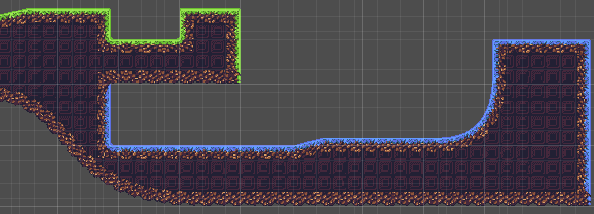

SmartShape2D
---

# About
**This is the GODOT 4 version of this plugin.
If you're looking for the GODOT 3 version, please go [here](https://github.com/SirRamEsq/SmartShape2D/tree/Godot3-latest)**

This plugin allows you to create nicely textured 2D polys.
Simply place a few points then create / assign the shape material and you should have a good looking polygon.

The textures used are similar to what you would use if making terrain using TileMaps/TileSets

**If you find any issues, by all means let us know.
Read the section below on Contributing and post an issue if one doesn't already exist**

**If you enjoy this tool and want to support its development, [I'd appreciate a coffee ](https://www.buymeacoffee.com/SirRamESQ) :)**

---

# Support
- Newest version is developed for Godot 4
- Older version is supported and tested on Godot 3.2
  - Should work with later versions of Godot 3.x

# Demo
A Sample Godot Project can be found here:
https://github.com/SirRamEsq/SmartShape2D-DemoProject

# Documentation
- [How To Install]( ./addons/rmsmartshape/documentation/Install.md )
- [Quick Start]( ./addons/rmsmartshape/documentation/Quickstart.md )
- [Using SmartShape2D with Godot 4.0](./addons/rmsmartshape/documentation/Godot4.md)
- [Migrating from 1.x]( ./addons/rmsmartshape/documentation/Migration.md )
- [Shapes]( ./addons/rmsmartshape/documentation/Shapes.md )
- [Toolbar]( ./addons/rmsmartshape/documentation/Toolbar.md )
- [Resources]( ./addons/rmsmartshape/documentation/Resources.md )
- [Normals]( ./addons/rmsmartshape/documentation/Normals.md )
- [Controls and Hotkeys]( ./addons/rmsmartshape/documentation/Controls.md )
- [FAQ]( ./addons/rmsmartshape/documentation/FAQ.md )
- [Version History]( ./addons/rmsmartshape/documentation/VersionHistory.md )

# Video Tutorials
SmartShape2D + Aseprite tutorial can be found here (Thanks Picster!):

SmartShape2D tutorial can be found here (Thanks LucyLavend!):

# Contibuting
## Issues
If you have any suggestions or find any bugs, feel free to add an issue.

Please include the following three bits of information in each issue posted:
- Bug / Suggestion
- Godot Version
- SmartShape2D Version

Some Guidelines for Issues:
- Attaching a sample project where the issue exists is the fastest way for us to see what's going on
- Try to be as descriptive as possible
- Pictures and screenshots will also be very helpful

Issues can be added [here](https://github.com/SirRamEsq/SmartShape2D/issues)

## Development
We have a set of tests we run against the code (courtesy of [GUT](https://github.com/bitwes/Gut)).

If making a merge request, please ensure that the tests pass. If the tests have been updated appropriately to pass, please note this in the merge request.

## Discord
We have a Discord server for the plugin. https://discord.gg/mHWDPBD3vu

Here, you can:
- Ask for help
- Showcase your project
- Speak with the developers directly

