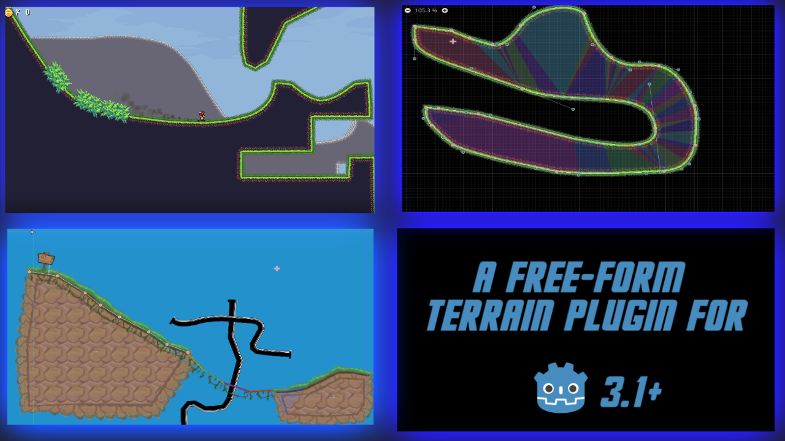
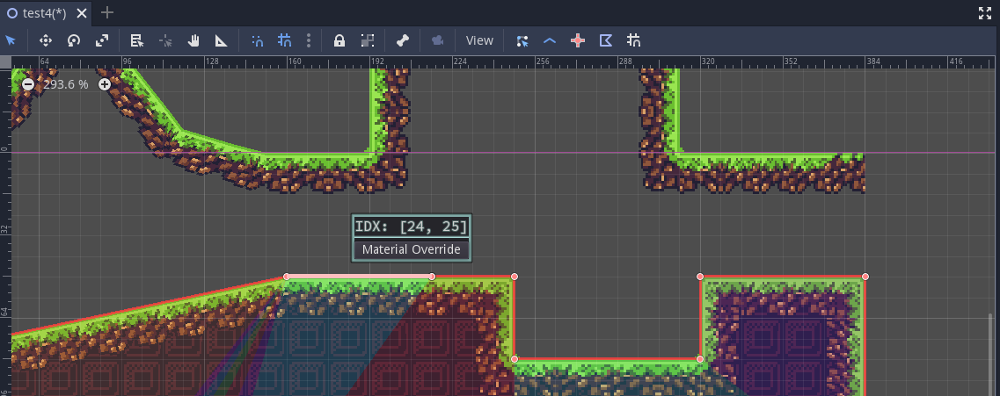

SmartShape2D
---

# About
This plugin allows you to create nicely textured 2D polys.
Simply place a few points then create / assign the shape material and you should have a good looking polygon.

The textures used are similar to what you would use if producing your levels with tilesets.

## Support
- Supported and Tesetd on Godot 3.2
- Should work with later versions of Godot 3.x

# Using The Plugin (Quickstart)
- [See here](./README-Quickstart.md)

# Shapes
Each shape consists of a set of points.
There are two kinds of shapes:
- Closed Shapes
  - The last point is connected to the first, forming a closed polygon
- Open Shapes
  - The last point is NOT connected to the first

There are two basic parts of any shape;
- The Edges
- The fill texture (Closed shape only)

Shapes can be configured to have multiple edges, each auto-generating at certain angles.

## Properties
### Editor Debug
- Will show the bounding box for each quad in the mesh of edges.
- Can be helpful to illustrate why a shape doesn't look the way you expect
### Flip Edges
- Will flip the edges of the shape (invert y)
### Render Edges
- Whether or not the edges of the shape should be rendered
### Collision Size
- Size of the collision shape
### Collision Offset
- Offset of where the collision shape starts and ends
### Tessellation Stages
- Number of stages in the curve tessellation process (Uses Curve2D Internally)
- First Param in Curve2D.tessellate
  - See [Curve2D Documentation](https://docs.godotengine.org/en/3.2/classes/class_curve2d.html#class-curve2d-method-tessellate)
### Tessellation Tolerence
- Tolerence Degrees in the curve tessellation process (Uses Curve2D Internally)
- Second Param in Curve2D.tessellate
  - See [Curve2D Documentation](https://docs.godotengine.org/en/3.2/classes/class_curve2d.html#class-curve2d-method-tessellate)
### Curve Bake Interval
- Bake interval value for Curve2D
- See [Curve2D Documentation](https://docs.godotengine.org/en/3.2/classes/class_curve2d.html#class-curve2d-property-bake-interval)
### Collision Polygon Node Path
- The path to the CollisionShape that the SmartShape will use for collision
- Is Autoset when pressing the generate collision button
### Shape Material
- The material that this shape will use to render itself
### Points
- All of the points and meta-data for the points contained in this shape
- This data structure is updated as you manipulate the shape
- There is no need to edit this by hand, but you can if you'd like
### Material Overrides
- When an edge is given a "Material Override" the data for that edge is stored here
-  :TODO - Add image of EdgeData window

- This data structure is updated as you manipulate the shape
- There is no need to edit this by hand, but you can if you'd like

# Shape Materials
Shape materials provide all the texture and collision information needed by the SmartShape nodes.
Once a shape material is defined, it can be easily reused by any number of SmartShape2D nodes.

A shape material consists of **Edge Meta Materials**
## Edge Meta Materials
An Edge Meta Material consists of pairs of **Edge Materials** and **Normal Ranges**
### Normal Range
The Normal Range indicates when a texture should be rendered
- If the normal range is 0 - 360 or 0 - 0, then any angle is considered in range and the edge will always render
- Angle "0" is Facing directly Right
- Angle "90" is Facing directly Up
- Angle "180" is Facing directly Left
- Angle "270" is Facing directly Down
### Edge Materials
The actual textures used to define an edge

For all cases, using texture normals is completely optional
#### Textures / Normals
- The primary textures used for the edge
- At least one texture must be defined
- 
#### Taper Textures / Normals
These textures will be used as the first or last quad in an edge.
They're named "Taper Textures" because the purpose is to show the edge "tapering off"
- Textures_Taper_Left is the first quad in an edge
  - 
- Textures_Taper_Right is the final quad in an edge
  - 
#### Corner Textures / Normals
These textures will be used when the edge forms a sharp corner (80 degrees - 100 degrees)
These are used because corners can look warped when using only regular textures
- Texture_Corner_Inner is used when the corner forms an inner corner
  - 
- Texture_Corner_Outer is used when the corner forms an outer angle
  - 

# Anchoring Nodes to Sections of the Shape Node
You might have a desire to anchor nodes to various sections of the SmartShape2D node.  This is helpful in the level design by helping to automatically move other nodes in relation to the edited shape node.  Or, in the future, it might be useful adjust a shape dynamically and have the surrounding objects be affected by adjustments in the shape's contour.

This is done by use of the SmartShapeAnchor2D node.

# Keyboard Controls
- Cycle through texture indices of a vertex
  - Mouseover a vertex and MOUSEWHEEL up or down to increment / decrement the texture index

- Flip texture
  - Mouseover a vertex and press SPACE

- Move Edge
  - While in MOVE mode, mouseover an edge, hold SHIFT, then click and drag to move the two points that makeup the edge

- Add Bezier curve
  - Mouseover a vertex, hold SHIFT, then click and drag to create control points on the vertex

- Change texture width property
  - Mouseover a vertex, hold SHIFT, then MOUSEWHEEL up or down to increment / decrement the texture width

# Contibuting
If you have any suggestions, feel free to add an issue.
Please include the following three bits of information in each issue posted:
- Bug / Enhancement / Suggestion
- Godot Version
- SmartShape2D Version

We have a set of tests we run against the code (courtesy of [GUT](https://github.com/bitwes/Gut)).
If making a merge request, please ensure that the tests pass (or have been updated appropriately to pass)

# Version History
## 2.0
### Changes from 1.0
### New Features
