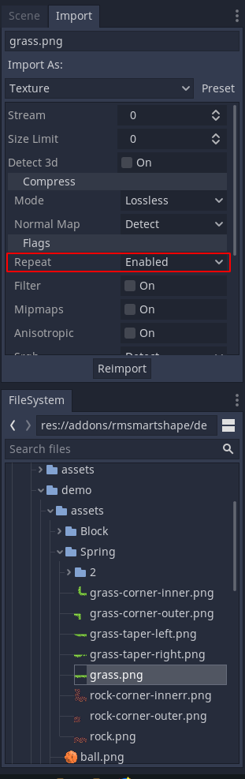

SmartShape2D - FAQ
---

# Why aren't my textures repeating?
If your textures aren't repeating and look something like this:

The issue is most likely that you need to set the texture's import options in Godot:

# Why isn't my shape updaing when I change the Light Mask?
Each shape is currently rendered by multiple-subnodes (Children Node2Ds).
Their owner isn't set, making them invisible in the editor (unless you have debug mode on).

Unfortunately, there is no accessible signal when changing the Light Mask setting in editor.
That means changing the Light Mask setting in editor won't trigger the children nodes to change THIER Light Mask

The Shape nodes CAN update their children's light mask, they just need to be triggered to do it manually.
If you update the shape in any way, the shape will update its children's light mask.

When playing the game, the render Node children are regenerated, ensuring that the light mask will be set
correctly.

The actual shape has set\_light\_mask overloaded, so changing the light\_mask in code should work without issue

If you need to manually tell the shape to update its rendering, call the set\_as\_dirty() method

If anyone has any insights on this issue, please feel free to open an issue on this subject
and let us know how we might be able to fix it

# Why does changing the width look so ugly?
Changing the width of the quads generally looks best with welding turned off.

If welding is on, you can still change the width of the quads, but you may need to play with it a bit.
It's best that you change the width gradually in small increments instead of sharply.
Sharply changing the width will result in odd looking shapes.

[Non-perspective rendering to a non-parallelogram is kinda tough](http://reedbeta.com/blog/quadrilateral-interpolation-part-1/)

If anyone has any insights on this issue, please feel free to open an issue on this subject
and let us know how we might be able to fix it
