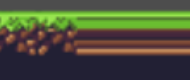
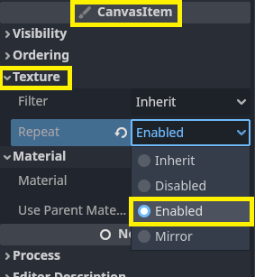
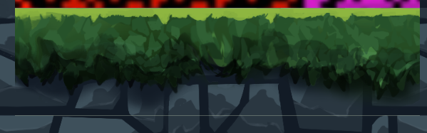

# SmartShape2D - FAQ

<!-- TODO: Outdated. -->

## Why aren't my textures repeating?

> [!NOTE]
> Starting with SS2D v3.3, edge textures will always be tiled regardless of the `repeat` setting.

If your textures aren't repeating and look something like this:



The issue is most likely that you forgot to enable texture `repeat`.




## Is there a way to resize edges?

No. Edge size is always determined by texture size.

Pull Requests that implement this feature are welcome!

A workaround could be to assign a dummy texture in the desired size and using a shader to sample the actual texture instead.


## Why is there a thin line around the edge?



In the image above you can see a thin 1 px border at the bottom of the shape edge.

This is a common graphical artifact *unrelated to SS2D*, that occurs due to how GPUs handle texture sampling.
It is not a bug but normal GPU behavior.
The top pixel row is "bleeding" into the bottom row due to texture interpolation with texture repeat enabled.

**Tl;dr**: The workaround is to add a transparent line of pixels at the top and bottom of the texture. Read on for a more in-depth explanation.

During texture interpolation the GPU takes the neighboring pixels into account.
When texture repeat is enabled, the wrapping behavior also extends to interpolation, which means if a pixel at the very edge of a texture is sampled, the GPU considers pixels from the opposite side of the texture as neighbors.

This causes the color values from opposite edges to bleed into each other, creating the visible seam. Even with nearest-neighbor interpolation, this effect may occur due to floating-point imprecision.

Other common scenarios where this issue appears are tile maps and atlas textures.
Imagine a large atlas texture with all tile textures packed right next to each other.
This may cause borders to appear at tile edges because the edge pixels of the neighboring tiles in the atlas bleed into each other.

The standard solution is to add a transparent border of pixels around the texture edges to hide the bleeding where it is not desired.

See also [Texture Coordinate System for OpenGL](https://hacksoflife.blogspot.com/2009/12/texture-coordinate-system-for-opengl.html) for more information about texture sampling in graphics rendering.


## Why isn't my shape updating when I change the Light Mask?

There is no accessible signal when changing the Light Mask setting in editor, hence no update is triggered.
The light mask will be correctly set on the next shape update.

If you need to tell the shape to update its rendering by code, call the `set_as_dirty()` or `force_update` method.

## Why does changing the width look so ugly?

Changing the width of the quads generally looks best with welding turned off.

If welding is on, you can still change the width of the quads, but you may need to play with it a bit.
It's best that you change the width gradually in small increments instead of sharply.
Sharply changing the width will result in odd looking shapes.

[Non-perspective rendering to a non-parallelogram is kinda tough](http://reedbeta.com/blog/quadrilateral-interpolation-part-1/)

If anyone has any insights on this issue, please feel free to open an issue on this subject
and let us know how we might be able to fix it


## The shape is not rendered

Usually appears in combination with the following error message.

> canvas_item_add_polygon: Invalid polygon data, triangulation failed

This error indicates there are inside-out parts, i.e. edges intersecting other edges.
It is often caused by having two consecutive points at the same position.

When generating closed SmartShapes programmatically, make sure to call `get_point_array().close_shape()` and do not manually add the closing point.


## How to create shapes programmatically?

- Shapes can be manipulated programmatically using the API of `SS2D_Point_Array`.
  The point array of a shape node can be retrieved using `get_point_array()`.
  Refer to the in-engine help of `SS2D_Point_Array` for further information.
- Do not use deprecated functions, they will be removed in future versions.
- When generating closed SmartShapes programmatically, make sure to call `close_shape()` and do not manually add the closing point.
- When doing multiple modifications, always wrap the code between `begin_update()` and `end_update()` to prevent intermediate regenerations.
- When creating large complicated shapes during runtime, consider reading the next section about performance optimization as well.

Below is an example script that creates a closed shape with four randomly placed corners.

```gdscript
func generate_shape(shape: SS2D_Shape) -> void:
    var pa := shape.get_point_array()

    # Begin modifying the shape. Calling this function prevents unnecessary intermediate updates.
    pa.begin_update()

    # Clear any existing points
    pa.clear()

    # Add 4 points, one for each corner with random offset
    pa.add_point(Vector2(randf_range(-100, 100), randf_range(-100, 100)))
    pa.add_point(Vector2(randf_range(300, 500), randf_range(-100, 100)))
    pa.add_point(Vector2(randf_range(300, 500), randf_range(300, 500)))
    pa.add_point(Vector2(randf_range(-100, 100), randf_range(300, 500)))

    # Close the shape
    pa.close_shape()

    # Apply changes
    pa.end_update()
```


## How to improve performance / increase shape generation speed?

Mostly relevant when generating shapes programmatically during runtime.
Mesh and collision generation may cause lag spikes depending on the complexity of the shape.
Especially collision generation is computationally expensive.

- You can tweak `tessellation_stages` and `tessellation_tolerance` to reduce the amount of vertices.
  They are located in the `SS2D_Point_Array` resource under `Geometry -> Points`.
  This is a very effective way to reduce computation time, but it sacrifices detail.
- Larger shapes require more generation time. Try to split large shapes into multiple smaller shapes if possible to avoid lag spikes.
- Do not use the `Legacy` collision generation method. It is inaccurate and slow.
- For static shapes, use `Collision Update Mode = Editor` to generate collisions only in editor so in-game loading times are faster.
