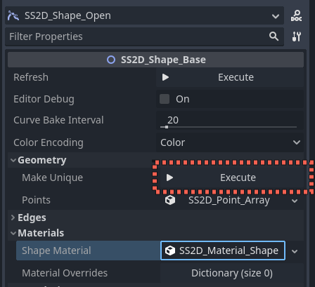
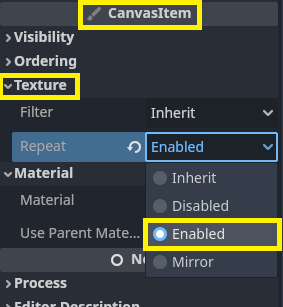
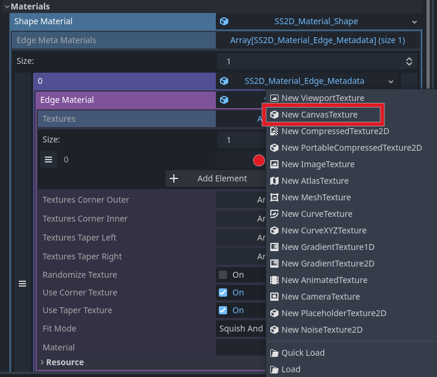
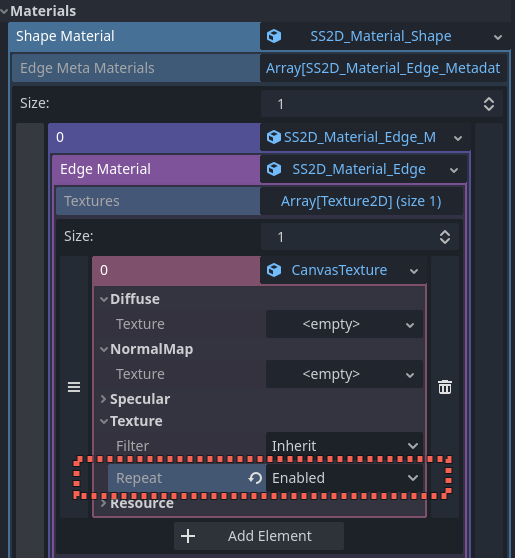

# Using SmartShape2D with Godot 4

Godot 4 moved `repeat` for textures as an import option to a per-node option. On how to make textures repeat and
set normal maps see [section below.](#repeating-textures-and-normal-textures-with-canvastexture)

By default, **shape resources are shared** when the shape is copy-pasted. Editing points will edit every copy of that shape.
To make point geometry unique, press **"Make Unique"** property button in Geometry property group in the inspector:

## Repeating Textures and Normal Textures with CanvasTexture

CanvasItem, the base class of Node2D has a Texture section with `repeat`.  If you aren't using a normal, you can set it here.
By default, this setting is inherited by children nodes so you could set it on a parent node (assuming all the children need
repeating textures or it's easier to disable for a few specific nodes than turn it on for most).

Normal textures are no longer set in a material resource.

To set normal textures, you can create a `CanvasTexture` resource in the inspector on any property, that allows setting a `Texture2D`.

`CanvasTexture` allows you to assign diffuse texture and normal map texture, as well as set textures to `repeat`:

## Converting Projects from Godot 3.x

Scene files with shapes saved in Godot 3.x should load in Godot 4 project. However, you may encounter some issues. Here is a list of expected problems:
1. Textures are looking weird, not repeated.
2. Normal textures are not used.

Please read the section on [how to set repeat and use normal textures in Godot 4](#repeating-textures-and-normal-textures-with-canvastexture).

## Removed Features

- The Godot 4 version of this addon does not support 1.x RMSmartShape2D nodes anymore.
- SS2D_Shape_Meta node was removed, since its functionality is available  copy-pasted shapes by default.
