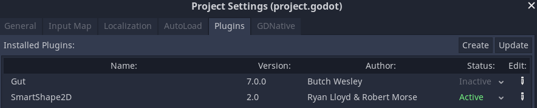

SmartShape2D - Install
---

# Asset Library
- After installing the plugin, you may encounter an error, this is normal.
- You need to restart Godot before using the plugin

# Manual Install
- Clone the repository at https://github.com/SirRamEsq/SmartShape2D/tree/godot-release
- Move the "addons/rmsmartshape" folder to your project's "addons" folder
- Open your project in Godot to have the addon install
- After installing the plugin, you may encounter an error, this is normal.
- Restart Godot

# Activate Plugin
- After Installing the plugin, activate the plugin by navigating to Project -> Plugins

