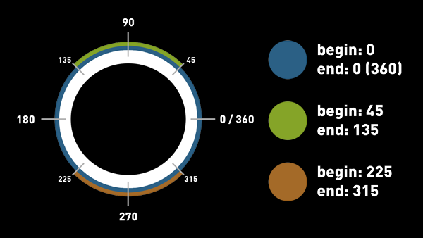

# SmartShape2D - Resources

<!-- TODO: Not all properties are covered. -->

## Shape Materials

Shape materials provide all the texture and collision information needed by the SmartShape nodes.
Once a shape material is defined, it can be easily reused by any number of SmartShape2D nodes.

- Edge Meta Materials
  - An array of resources of type SS2D_Material_Edge_Metadata
- Fill Textures
  - Used as the texture for the inside of the polygon for Closed Shapes
  - Currently, only the first texture can be used, multiple textures may be supported at a later date
- Normal Textures
  - In Godot 4, you can set normal textures with `CanvasTexture` resource.
- Fill Texture Z Index
  - Each Edge Meta Material has a ZIndex indicating which edges are drawn first
  - This sets the ZIndex for the fill texture
  - This allows the user to draw the fill texture in front of some edges or behind others
- Fill Mesh Offset
  - The Offset of the Fill Mesh
  - Can be used to grow / shrink the fill mesh
- Render Offset
  - Every edge in the shape will be offset by this amount
- Weld
  - Whether or not to weld the last quad of an edge with the first quad of the next edge

## Edge Meta Material

An Edge Meta Material doesn't contain the actual textures used to render an edge like **Edge Material** does.
Instead, this resource contains a single **Edge Material** and describes how and when to render the edge.

- Normal Range
  - The angles at which an edge is allowed to be rendered
- Weld
  - Whether or not to weld the quads in this edge
- Taper Sharp Corners
  - Edge vertices sharper than 90° that aren't rendered as corners, will be tapered and not welded
  - Will not work properly on shapes with curves
- Render
  - Whether or not this edge is visible
- Z Index
  - Dictates the order in which edges are drawn
- Offset
  - Offset of the edge
  - Can use a positive or negative value to draw the edges closer or further from the shape

## Normal Range

The Normal Range indicates when a texture should be rendered.
Each shape will compare the Surface Normal of an edge to the Normal Range in each Edge Meta Material.
If the edge's Normal is inside a Meta Material's Normal Range, the Meta Material's Edge Material is rendered.

- A Normal Range is specified in Degrees
  - If the normal range is 0 - 360 or 0 - 0, any angle is considered in range and the edge will always render
  - Angle "0" is Facing directly Right
  - Angle "90" is Facing directly Up
  - Angle "180" is Facing directly Left
  - Angle "270" is Facing directly Down

## Edge Material

The actual textures used to define an edge

### Textures

- The primary textures used for the edge
- At least one texture must be defined
- Example: 

### Taper Textures

These textures will be used as the first or last quad in an edge.
They're named "Taper Textures" because the purpose is to show the edge "tapering off"
- Textures_Taper_Left is the first quad in an edge
  - Example: 
- Textures_Taper_Right is the final quad in an edge
  - Example: 

### Corner Textures

These textures will be used when the edge forms a sharp corner (80 degrees - 100 degrees)
These are used because corners can look warped when using only regular textures
- Texture_Corner_Inner is used when the corner forms an inner corner
  - Example: 
- Texture_Corner_Outer is used when the corner forms an outer angle
  - Example: 

### Normal Texture and Repeat

To use normal textures, you can create a `CanvasTexture` resource in the inspector on any property,
that allows to set a texture. There you can assign your texture and your normal texture, as well as set
those to `repeat`.

### Repeat Textures

See previous section.

### Fit Mode

Most likely, the textures you use will not *perfectly* fit the polygon.
This setting allows you to determine how SmartShape will rectify this.

Differt options may look better or worse depending on the art-style.

- Sqush and Stretch
  - Texture will be mutated
  - Either slightly squished or stretched to fit the polygon
- Crop
  - Texture will not be mutated
  - Texture will simply be cropped when changing from one texture to the next

